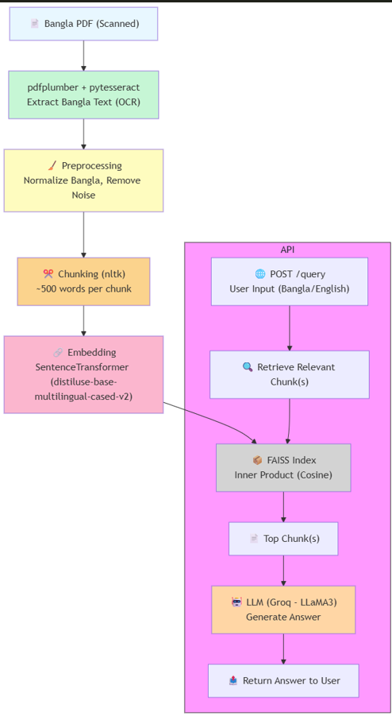

#  Multilingual RAG System 

This is a **Retrieval-Augmented Generation (RAG)** system capable of understanding user queries in **English and Bangla**  and generating grounded responses based on a document corpus. 

---

## 📌 Features

- ✅ Document chunking and vector-based semantic search
- ✅ Query handling in English and Bangla
- ✅ Groq LLM integration using LLaMA3
- ✅ PDF-ready architecture
- ✅ Easily extensible REST API 

---

## ⚙️ Setup Guide

### 1. Clone the repository
```bash
git clone https://github.com/PritoM-Debnath/RAG.git
cd RAG
```

### 2. Create and activate virtual environment
```bash
python -m venv .venv
source .venv/bin/activate  # or .venv\Scripts\activate on Windows
```

### 3. Install dependencies
```bash
pip install -r requirements.txt
```

### 4. Set your API key
Create a `.env` file:
```env
GROQ_API_KEY=your-api-key-here
```

---

## 🧰 Dependencies

- `fastapi` / `uvicorn` — REST API
- `sentence-transformers` — Embedding model
- `faiss-cpu` — Vector search
- `groq` — Answer generation
- `pdfplumber` — PDF text extraction
- `nltk` — Sentence chunking
- `python-dotenv` — Environment variable support

---

## 🔎 Sample Query Flow

```python
response = rag_pipeline(
    query="What did the hero do after the battle?",
    story_path=r""  # your text dataset path 
)
print(response)
```

---

## 🧪 Sample Queries & Outputs

| Language | Query                                     | Answer           |
|----------|-------------------------------------------|------------------|
| English  | Who has been called Anupam's goddess of fortune?    | Anupam's uncle has been called his goddess of fortune.|
| Bangla   | কাকে অনুপমের ভাগ্যদেবতা বলা হয়েছে?       | মামাকে            |


---

## 📑 API Documentation 


### 🛠️ Base URL
```
http://localhost:8000
```

---

### 🔍 POST `/query`

**Request:**
```json
{
  "question": "হরিশ কোথায় কাজ করে?"
}
```

**Response:**
```json
{
  "answer": "কানপুরে"
}
```

Or:
```json
{
  "answer": "দুঃখিত, প্রাসঙ্গিক তথ্য খুঁজে পাওয়া যায়নি।"
}
```

### Test with Swagger:
```
http://localhost:8000/docs
```

---


## 📈 Evaluation Matrix 

| Metric        | Method                                 |
|---------------|----------------------------------------|
| Groundedness  | Manual context overlap check           |
| Relevance     | Cosine similarity + human validation   |

---
## 🎆Workflow Diagram

## ✅ Q&A

### Q: What method or library did you use to extract the text, and why?
**A:**  used OCR and a combination of **pdfplumber**, **pytesseract**, and **Pillow** to extract text from the scanned Bangla PDF (HSC26-Bangla1st-Paper.pdf).

---

### Q: What chunking strategy did you choose?
**A:** Sentence-based chunking with a max word limit (500 words) using `nltk.sent_tokenize()`. This preserves semantic completeness and improves retrieval accuracy.

---

### Q: What embedding model did you use? Why?
**A:** `distiluse-base-multilingual-cased-v2` supports Bangla, additionally, 50+ languages`. It’s compact, fast, and delivers high-quality semantic embeddings suitable for small-scale RAG setups.

---

### Q: How are you comparing the query with your stored chunks?
**A:** Used FAISS for cosine similarity on embeddings. FAISS is efficient, production-ready, and scales well.

---

### Q: How do you ensure meaningful comparison between query and chunks?
**A:** Embeddings ensure semantic overlap. Prompt template ensures context injection before generation. For vague queries, the system still retrieves the closest relevant chunk.

---

### Q: Do the results seem relevant?
**A:** Yes, for most queries. However, results can be further improved by:
- Using multilingual embedding models (`distiluse-base-multilingual-cased-v2`)
- Fine-tuning chunk sizes
- Cleaning Bangla PDF more robustly

---

## 📂 Directory Structure

```
.
├── app/
│   ├── chunker.py
│   ├── data_loader.py
│   ├── embedder.py
│   ├── generator.py
│   ├── rag.py
│   └── retriever.py
├── data/
│   ├── data.txt
│   └── HSC26-Bangla1st-Paper.pdf
├── api/
|    ├── main.py
├── tests/
│   └── sample_queries.py
├── .env
├── requirements.txt
└── README.md
```

---

## 🔐 Security Note

API key is loaded from `.env` using `python-dotenv`. Make sure `.env` is added to `.gitignore`.

```bash
echo ".env" >> .gitignore
```

---

##  Future Work


- ✅ Multilingual embedding
- ✅ RAG evaluation module

---

## 📬 Contact

For questions, contact: `debnathpritom@outlook.com`  

